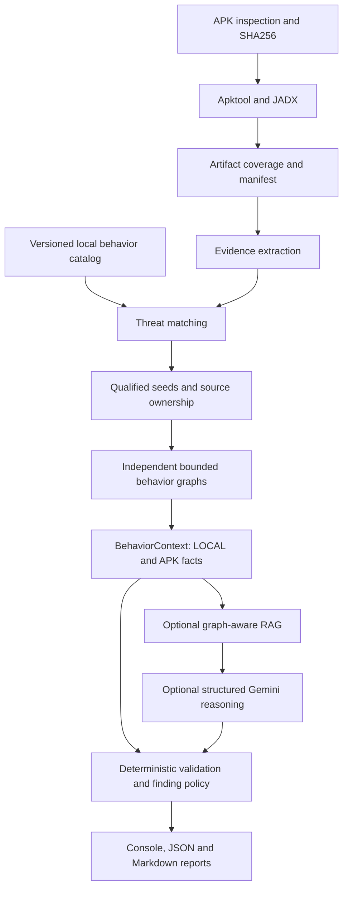

# SentinelRAG

SentinelRAG is a static Android malware-behavior investigation prototype. It connects APK evidence, bounded program analysis, a local behavior catalog, optional RAG and structured Gemini reasoning into JSON and Markdown reports.

It helps an analyst identify source-backed observations and the relationships that still need verification. It does not produce a definitive malware-family verdict, execute APKs or claim complete program recovery.

## Architecture



External knowledge stays separate from APK observations. The model cannot add graph edges, source locations, evidence states, severity or family attribution. Reference validation checks exact canonical facts and relationships; arbitrary model narrative remains untrusted audit material.

## Run

Use the existing Python environment with the project installed and external Apktool/JADX executables configured. No Android device or emulator is required.

```text
sentinel inspect sample.apk
sentinel decompile sample.apk
sentinel extract sample.apk
sentinel analyze sample.apk --output-json reports/sample-analysis.json
sentinel analyze sample.apk --output-json reports/sample-analysis.json --output-markdown reports/sample-analysis.md
sentinel analyze sample.apk --no-llm --no-rag --graph-depth 1
sentinel analyze sample.apk --profile docs/research/trickmo/extraction-profile.json
sentinel knowledge status
sentinel knowledge validate
```

`--profile` is repeatable. `--verbose` prints analysis ID and stage timings. Without an output path, reports go to `reports/<SHA256-prefix>-analysis.json` and `.md` under the repository. Relative input/profile/output paths resolve from the current directory. Configuration and bundled knowledge resolve from the repository.

Both `--no-llm` and `--no-rag` are required for fully offline analysis. Deterministic reports still work when optional AI services fail. Decompiler limitations remain explicit; missing code does not mean missing behavior.

## Configuration

Set `APKTOOL_PATH` and `JADX_PATH` in the environment or project `.env`. For optional AI use `GEMINI_API_KEY`. Never commit credentials.

| Setting | Default |
|---|---|
| `GEMINI_MODEL` | `gemini-3.5-flash-lite` |
| `GEMINI_EMBEDDING_MODEL` | `gemini-embedding-001` |
| `SENTINEL_EMBEDDING_DIMENSIONS` | 768 |
| `SENTINEL_GRAPH_DEPTH` | 1 (0?3) |
| `SENTINEL_GRAPH_NODE_LIMIT` | 500 hard maximum |
| `SENTINEL_GRAPH_METHOD_LIMIT` | 40 hard maximum |
| `SENTINEL_BEHAVIOR_SEED_BUDGET` | 12 per behavior |
| `SENTINEL_RETRIEVAL_TOP_K` | 3 (1?5) |
| `SENTINEL_REASONING_ENABLED` | true |
| `SENTINEL_RAG_ENABLED` | true |

Each reasoning investigation uses at most 160 graph nodes and 8 expanded methods, then selects at most 64 facts and 64 relationships for context. The serialized prompt payload is capped at 50,000 characters; oversized contexts fail safely. Gemini uses structured JSON, temperature 0, one candidate, a 2,048-token output budget, hidden thinking and no tools/function declarations. Model availability and quota depend on the configured provider account.

## Evidence contract

- **LOCAL:** source-located facts and supported graph relationships in the bounded investigation.
- **APK:** broader matches and manifest declarations. Co-occurrence does not imply local participation.
- **KNOWLEDGE:** retrieved documents, with document/chunk IDs, source and relevance score. Never APK proof.
- **LLM suggestions:** untrusted reasoning, hypotheses and proposed contradictions, retained separately for audit.

Ownership (`APPLICATION`, `APPLICATION_CANDIDATE`, `UNKNOWN`, `THIRD_PARTY`, `FRAMEWORK`, `GENERATED`) is independent of evidence state and artifact coverage. Obfuscated helpers may gain candidate ownership through bounded resolved calls; strange namespaces alone prove nothing. Framework bodies are not recursively expanded.

Source/sink annotations and expected behavior sequences are investigation hints, not taint paths. `PASSES_TO` requires the existing deterministic local-flow recognizer. Final severity is policy-based: indicator/co-occurrence reviews are INFO; the supported user-input-to-command flow is MEDIUM. Model confidence does not set either severity or final evidence confidence.

## Example report

A supported AndroGoat command flow can report:

```text
[MEDIUM] Investigation: Process and Command Execution
Evidence State: OBSERVED
Source: ip2.getText().toString()
Transform: StringBuilder command construction ("ping ")
Sink: Runtime.getRuntime().exec(ip1)
Exploitability and command-injection impact require additional validation.
```

The Markdown report includes identity, coverage, manifest attack surface, matches, seeds, behavior investigations, source relationships, retrieved knowledge, findings, unresolved relationships and limitations. JSON retains detailed references and untrusted structured reasoning. APK strings are escaped in Markdown.

## Knowledge and profiles

The versioned starter catalog covers 35 investigation areas, including Accessibility, collection, persistence, dynamic loading, network communication, device administration and reflection. These are analyst-authored templates with benign explanations, not a validated signature set. The existing JSON threat records remain supported. No automatic web ingestion or comprehensive malware-family database is claimed.

TrickMo profile matches remain research/correlation inputs. The generic profile verification-template executor is not implemented. A matching permission, API or string cannot establish the required behavior sequence or family identity.

## Tests and limitations

```powershell
& "C:\Users\meera\Desktop\AI engineering\venv\Scripts\python.exe" -m pytest -q
```

Normal tests block network access and mock providers. Real samples are analyzed statically only; never install or execute malware.

This is a portfolio prototype, not a production detection service. Static resolution is limited to supported Java layouts and direct source calls. Reflection, dynamic loading, Kotlin, ambiguous dispatch, incomplete JADX output and unobserved component transitions remain unresolved. The flow recognizer handles a narrow local command-construction pattern, not whole-program taint analysis. Catalog precision, source attribution and severity calibration need a larger labeled corpus. Embeddings are rebuilt in memory per run; persistent caching, robust decompiler isolation/timeouts and operational telemetry remain hardening work.

See [PROJECT_STATE.md](PROJECT_STATE.md), [PROJECT_PLAN.md](PROJECT_PLAN.md), [DECISIONS.md](DECISIONS.md), and [investigation graph details](docs/investigation-graphs.md).
